# Setting up on Windows

Follow these steps to deploy the system on **Windows 10+ (64-bit)**

## 1. Setting up PostgreSQL 18
### Step 1. Download the PostgreSQL Windows Installer 

Download the PostgreSQL from PostgreSQL official website. [Windows Installer](https://www.postgresql.org/download/windows/)


### Step 2. Setup PostgreSQL 18
1. Run the PostgreSQL installer to install Postgres on you computer.

 

2. You will be asked to specify a directory where you need the application to get installed, most go with the default option, but since I don't space in my C drive, I will install it in the D drive. If you too, want to change the directory, just click on the Browse icon and change the default location.

 

3. You need to select the components that you need install, The more components you wish to install the more space it will take. Depending on you needs, you may choose to skip using **Stack Builder**. Which is a graphical interface that simplifies the process of downloading and installing modules that complement your PostgreSQL installation. However, do not uncheck other.


4. You need to select the directory where you want to store all you data. Based on what you intend to do your database, select a local storage directory. By default, the data folder will be located inside the directory you intend to install PostgreSQL in, however, it can be altered. To change the directory, click on the Browse icon, navigate to the location where you want to store your data, and select a folder. Once done, click on next.


5. Set a password of you choice, since it is a local DB, there are no rules that you need to adhere to. Just pick a password that you can easily remember and click on Next.


6. Enter the port number if you have one, or leave it to the default number and click on Next.


7. You will be asked to select a language and location, you can select from the **Locale** drop-down menu. Typically, you can leave this as "DEFAULT" and click on Next.


8. Finally, review the summary, Once satisifed, and click on Next.


9. Installation preparation is complete, click on Next to begin the installation process, it might take some time. 


10. Wait for the installation to finish, Ensure that **"Stack Builder may be..." is unchecked**, then click on Finish to exit.


### Step 3: Create a database and user
1. Search out "PgAdmin" from the Start Menu and open the application. go to **Servers**, expand it, enter your password when asked. and click on OK, then access you DB.

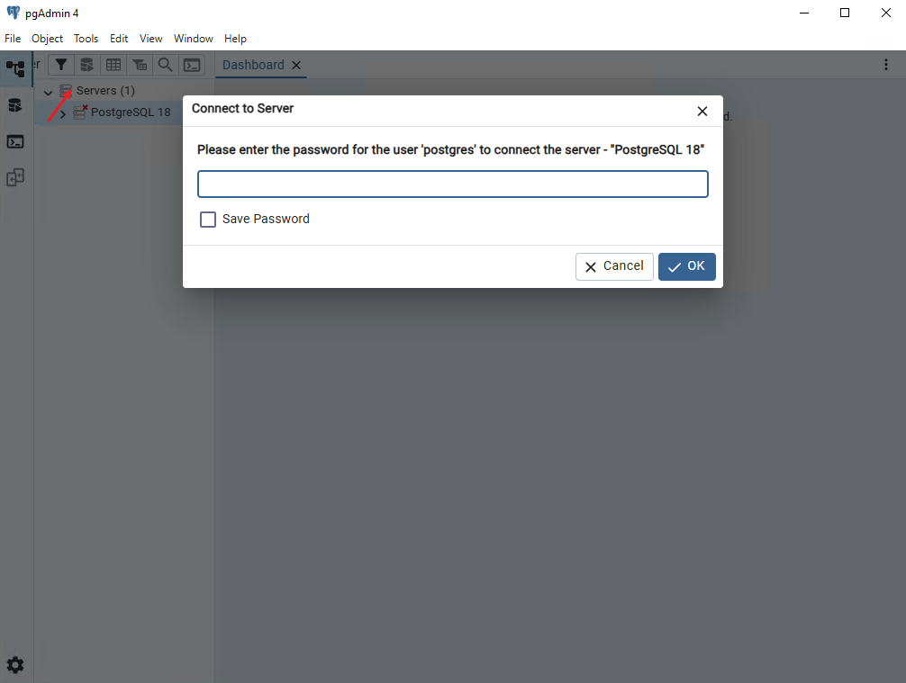

2. Naviage to "Tools" > "PSQL Tool" to open the PSQL Tool window.

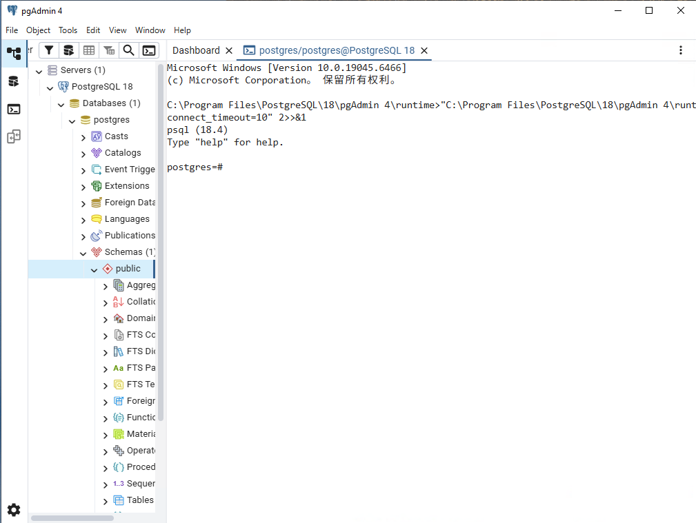

3. Run the following SQL commands(replace **yourPassword** with a secure password) in PSQL Tool window.
```sql
CREATE USER sccsmsuser PASSWORD 'yourPassword';
CREATE DATABASE sccsmsdb;
ALTER DATABASE sccsmsdb OWNER TO sccsmsuser;
```

## 2. Setting up RustFS
Note: In light of MinIO's strategic shift toward MinIO AIStor, we recommend adopting RustFS as an alernative for S3-compatible storge.

### Step 1: Download Installer
Download RustFS Windows x86_64 Installer from [Windows x86_64 Installer](https://rustfs.com/download/?platform=windows)

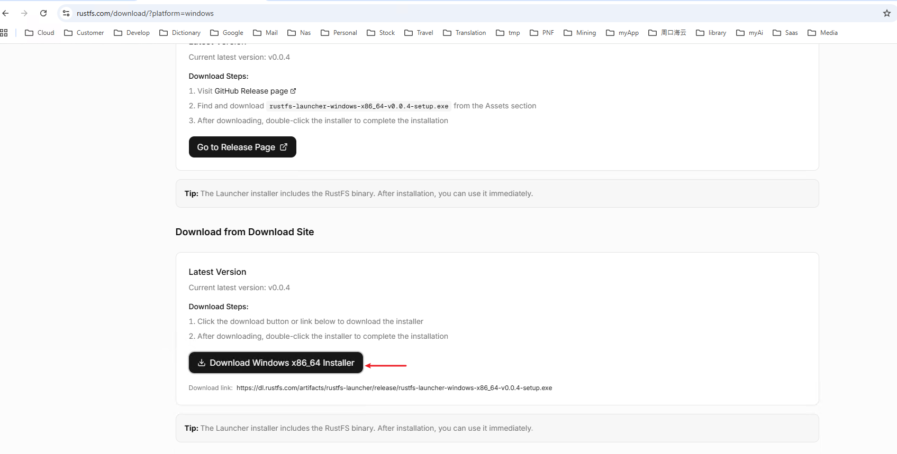

### Step 2: Install RustFS Launcher
1. Run the RustFS Launcher to install RustFS on you computer.

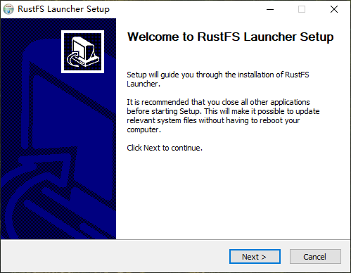

2. You will be asked to specify a directory where you need the application to get installed, most go with default option. If you want to change the directory, just click on the Browse button and change the default location. Click on Next to begin the installation process.

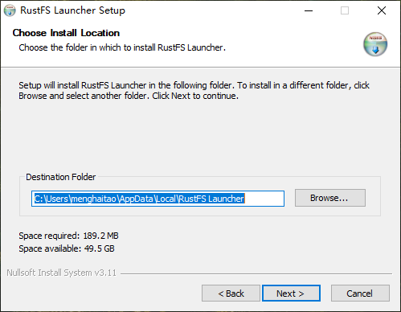

3. Wait for the installation to finish.

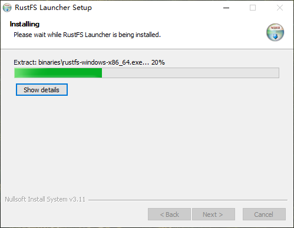

4. Ensure that **Run RustFS Launcher** is checked, then click on Finish to run RustFS Launcher.

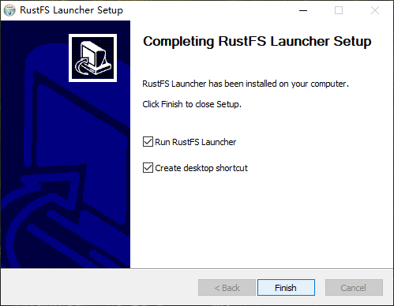

### Step 3: Setup RustFS
1. **Configure:** In the RustFS Launcher, enter the required settings:
- **Data Path:** The directory where your data will be stored.
- **Port:** The Port number for the service. .(**Note: You must add this port to the firewall Inbound Rules.**)
- **Host:** The host address (Enter "0.0.0.0" to allow the service to listen on all available network interfaces.)
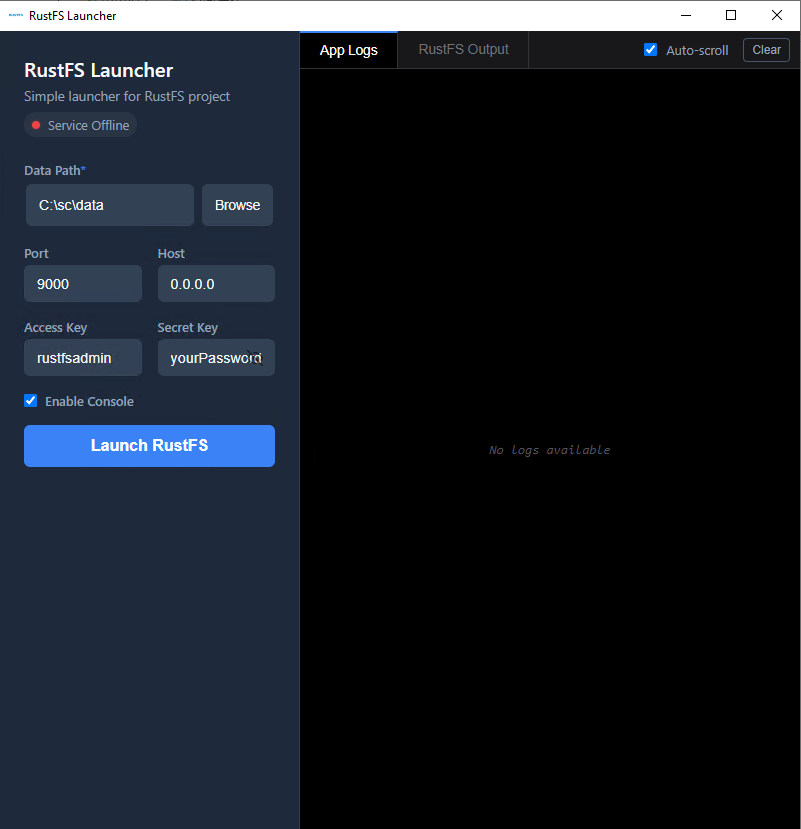
2. **Launch Service:** Click **"Launch RustFS"** to start the service.
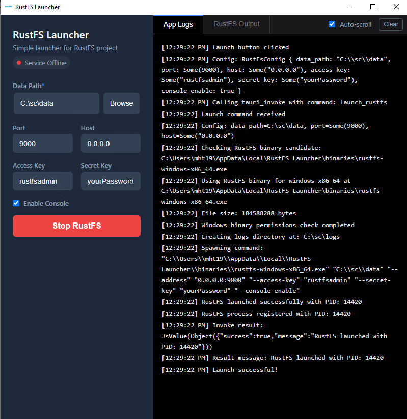


## 4. Setting up Sea&Cloud Construction Site Management System(SCCSMS)
### Step 1: Download SCCSMS Release
Download the latest release from GitHub.[sccsmsserver-windows-x86_64.zip](https://github.com/hnmht/sccsms/releases/download/v1.0.0/sccsmsserver-windows-x86_64.zip)

Create a folder to store the sccsmsserver application(e.g., **E:\sccsms**), and extract the downloaded **sccsmsserver-windows-x86_64.zip** file into this folder.

Download the default confiuration template from GitHub. [config.yaml](https://raw.githubusercontent.com/hnmht/sccsms/main/document/yaml/config.yaml), and copy it into the folder.

### Step 2: Configuration
Open the config.yaml file with Notepad, Configure the following parameters to match your environment:
- general settings: **port**, the server listens on for HTTP requests. (**Note: You must add this port to the firewall Inbound Rules.**)
- postgresql：Update **dbname**, **username**,**password** according to the PostgreSQL 18 configuration in Step 3.
- s3storage: Update **endpoint**, **accesskeyid**, **secretaccesskey** to match the RustFS settings established in Step 3.

```yaml
addr: ""
name: "sccsmsserver"
mode: "release"
port: 10033
start_time: "2026-01-01"
machine_id: 101
tls: false
certificatefile: "cert.pem"
privatekeyfile: "key.pem"
userlockth: 5
iplockth: 10
iplockedminutes: 15

log:
  level: "debug"
  filename: "sccsmsserver.log"
  max_size: 200
  max_age: 30
  max_backups: 7

postgresql:
  host: "localhost"
  port: 5432
  dbname: "sccsmsdb"
  username: "sccsmsuser"
  password: "yourPassword"
  max_open_conns: 200
  max_idle_conns: 50
  max_record: 5000

s3storage:
  endpoint: "http://192.168.3.31:9000"
  accesskeyid: "rustfsadmin"
  secretaccesskey: "yourPassword"
  secure: false
  selfsigned: false
  defaultbucket: "sccsms"
  location: "ap-guangzhou"

redis:
  enabled: false
  host: "127.0.0.1"
  port: 6379
  db: 0
  password: "yourPassword"
  pool_size: 100
```

For detailed configuration documentation, please refer to [config.md](/document/yaml/config.md)

### Step 3: Configure the Windows Firewall
Optional: This is only required the Firewall is enabled on your Windows computer.
1. To configure Windows Firewall, start by opening the Windows Security app. You'll find the firewall controls under "Firewall & network protection". This central hub allows you to manage all aspects of your firewall settings.

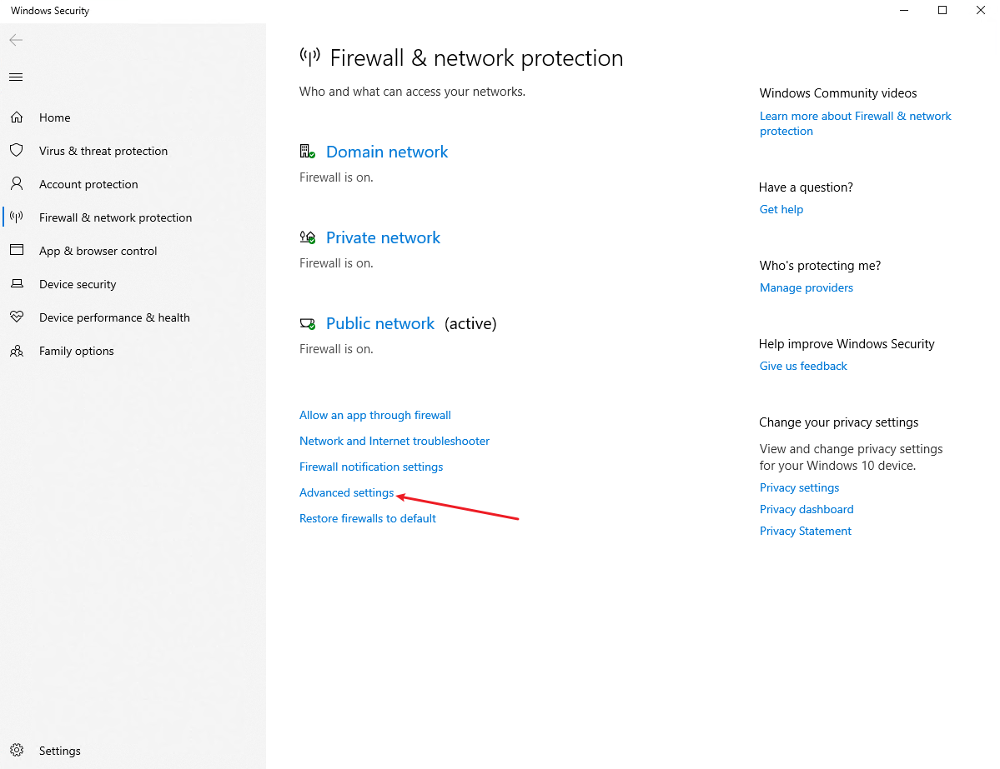

2. Click **Advanced Settings**. You will be prompted by User Account Control to give Administrative access to Windows Defender to make changes. Click **Yes** to proceed.

3. Select **InBound Rules** in the left panel, then click **New Rule...** in the right panel.

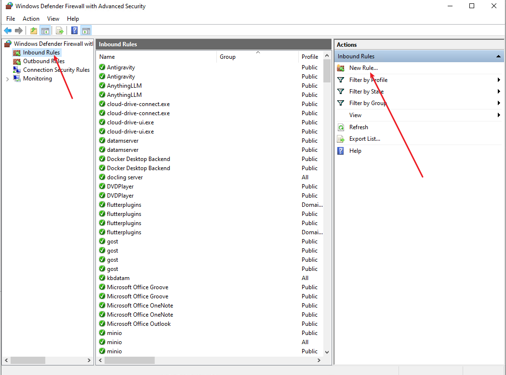

4. A **New Inbound Rule Wizard** window pops-up, select **Port** option and click next.

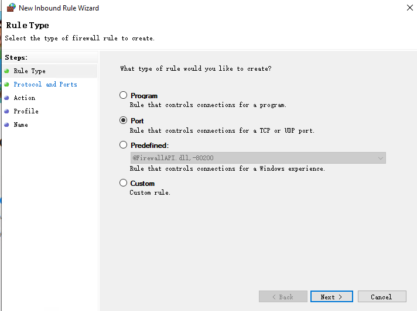

5. Now select **TCP** and specify port number. (**Note:The port number consists of the RustFS defined earlier and the port defined in the SCCSMS Generation Settings, separated by a comma.**)

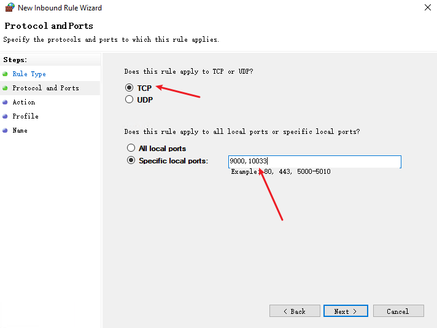

6. Select **Allow the connection** and click next.

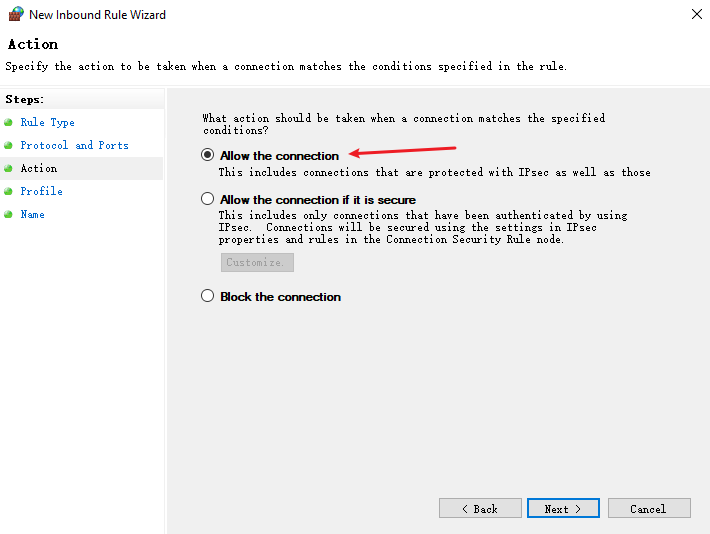

7. Specify when should this rule come into action. Select all and click next.

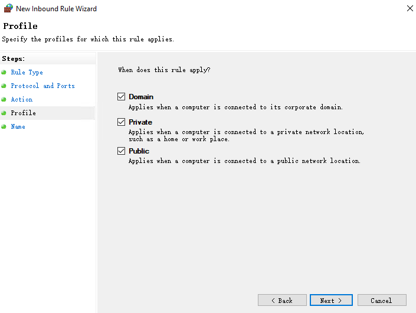

8. This is the last step. Here we provide a name to this rule. Type the name(e.g., sccsmsAndRustFS) and click Finish.

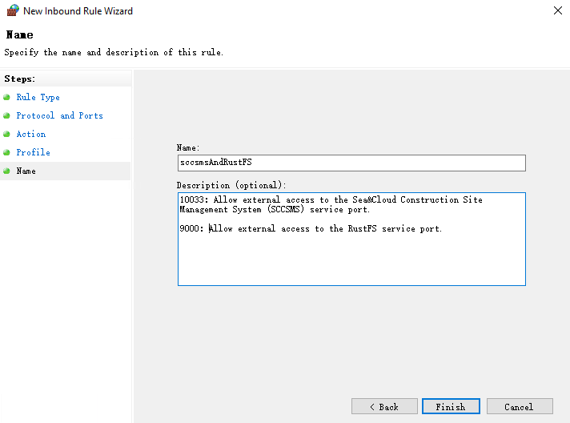

### Step 4: Start SCCSMS Server

Once RustFS is running, double-click "sccsmsserver.exe" to launch the program, A Service window will appear, indicating that the service has started. Do not close this window while the software is in use.

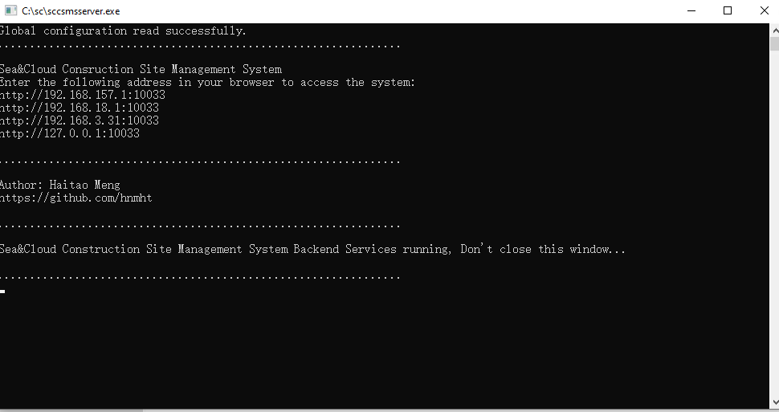

### Step 5: Accessing the System
You can access your SCCSMS instance via your server's IP address and the configured port(e.g., [http://192.168.3.31:10033](http://192.168.3.31:10033))

1. Open a modern web browser(e.g., Chrome or Edge).
2. Enter the URL(http://your-server-ip:port).
3. From the homepage, you can download the mobile client installer or click Login to access the system dashboard.

Default Credentials:
- **User Code:** admin
- **Password:** sc@123

**Security Note:** For security reasons, please change your password immediately after your first login.


